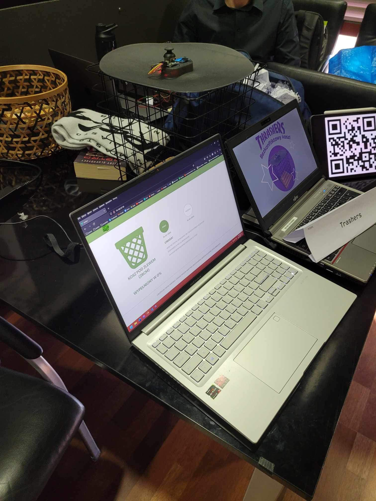
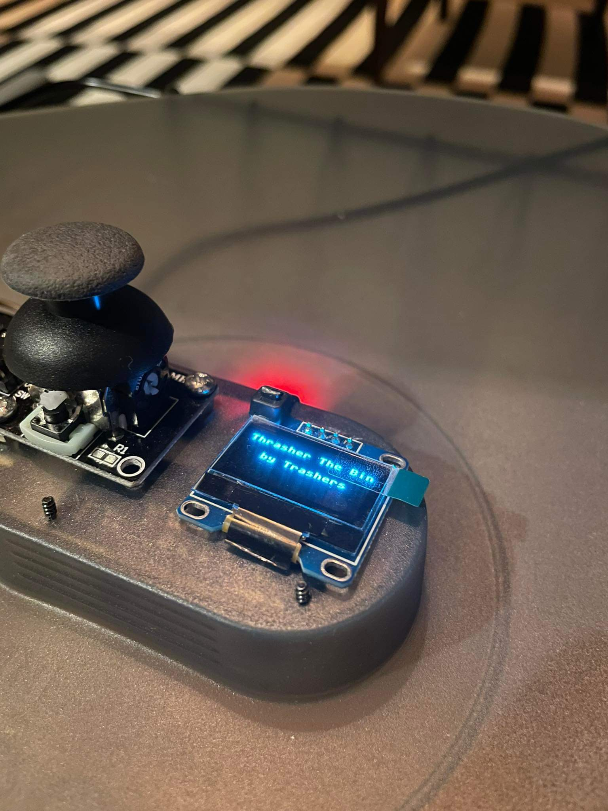
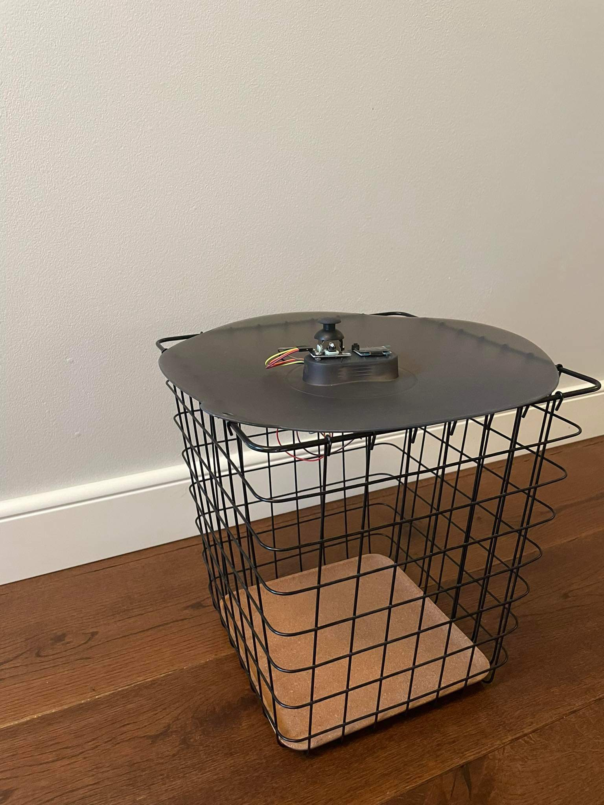
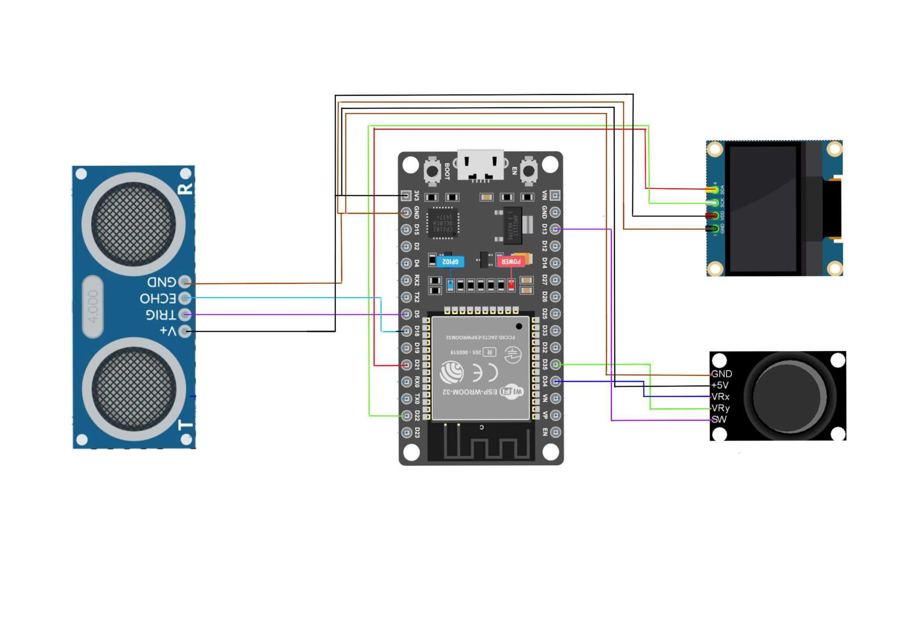

# Trash

## Project Setup
```
npm install
```

### Development Mode (used during development)
```
npm run serve
```

### Build (to be hosted on the server)
```
npm run build
```

# Documentation

## Frontend

### Introduction

The frontend of our application has been fully realized using the reactive JavaScript framework - Vue.js. This advanced tool enables the creation of dynamic and interactive user interfaces. Our website is optimized as an interface for managing our REST API, allowing efficient communication with the server. The site is responsive, adapting to both computer monitor sizes and mobile screens.

### Project Structure

The project is divided into views that represent logically separated subpages. Access to individual views is obtained by using the link tree provided by Vue Router.

Each component (view) consists of three main parts:

- HTML: Defines the structure and layout of elements on the page.
- JavaScript (Vue.js): Responsible for the component's logic, data interaction, and dynamic interface updates.
- SCSS (Cascading Style Sheets): Contains styles that define the appearance and layout of the component.

### File Structure

The most important folder containing the frontend is /src. It includes key elements such as:

- Assets: Resources such as images, icons, etc.
- Components: Vue.js modules representing individual parts of the page.
- Fonts: A folder containing the fonts used.
- Styles: Stylesheets in the form of SCSS files.
- Vue Router: The link tree structure for navigation between components.

### Vue.js Version

The frontend was built using Vue.js version 3.3.12. Utilizing the latest version of the framework allows for the use of the latest features.

### Project Expansion

The entire project was created with future expansion in mind. The modular project structure and the use of Vue.js as a reactive framework make it easier to add new features and components.

## Backend

### Running
```
trashAPI/ python manage.py runserver
```

### Introduction
The backend was developed using Django Rest Framework. It allows communication between the database, the board, and the website. It provides data in JSON format.

### File Structure
The most important files in the project are:
- models.py - the file containing classes corresponding to the database tables.
- serializers.py - the file containing the serializers for data from the models.
- views.py - the file where models and serializers are used to handle API requests and logic.

### Functionality
The backend, besides its basic functionality, also allows sending emails to users after each trash collection. It adds the current dates to the database tables to minimize the tasks that the board must perform. You can "talk" to it through classic Python requests, but you can also view data by entering {site url}:8001 in the browser.

## HTTP Server on Linux Mint with Nginx (Vue) and Daphne (Django)
### Project Description

The project involves implementing an HTTP server on the Linux Mint operating system, with two main parts: the frontend served by Nginx with the Vue framework, and the backend served by Daphne with the Django framework.

### Project Components
1. Frontend (Nginx + Vue)

    Nginx: One of the most popular HTTP servers, acting as a reverse proxy. Installed on the Linux Mint system, configured as an interface between external HTTP requests and the Vue server.

    Vue: A JavaScript framework for building user interfaces. It runs on port 8001 and is responsible for handling the frontend layer.

2. Backend (Daphne + Django)

    Daphne: An HTTP server for Django applications. It runs on a socket port, handling requests asynchronously.

    Django: A web framework based on Python. It handles requests from Daphne, constituting the backend layer of the project.

### HTTP Implementation on Linux Mint
1. Nginx (Vue)

    Installing Nginx on Linux Mint: Nginx was installed on the Linux Mint system using the package manager. The Nginx configuration includes handling traffic on port 8001 and redirecting to the Vue application.

2. Daphne (Django)

    Installing Daphne on Linux Mint: Daphne was installed as an HTTP server to support Django applications on the Linux Mint system.

    Configuring Daphne: Daphne was configured to handle the Django application, and Nginx was set up as a reverse proxy, redirecting requests to the socket port handled by Daphne.

### Project Structure

The project structure is organized to allow easy management and maintenance of both the frontend and backend. Each part (Vue and Django) is separated, making it easier to develop and scale the project.

### Monitoring and Testing

After configuring HTTP, it is important to regularly monitor the availability of both parts of the project. Testing should include both the frontend and backend to ensure that both functions are available and working as expected.

### Conclusion

The informational documentation contains basic information about the project, describing the main components, the method of implementing HTTP on the Linux Mint system, and the project structure.

### Photos from realization



